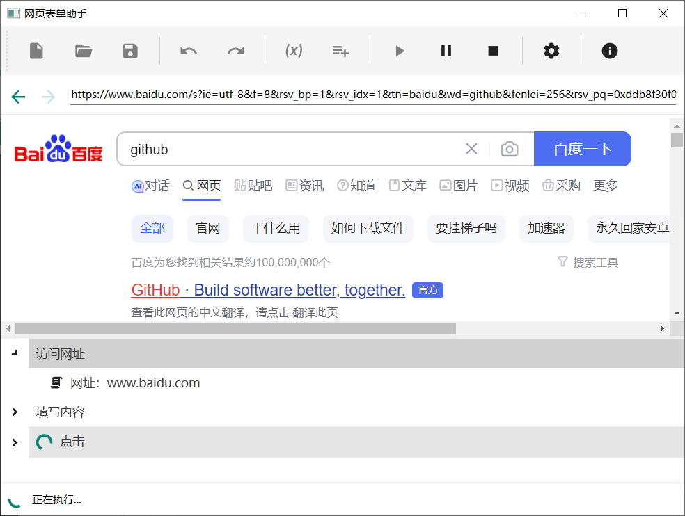

# 网页表单助手

## 简介

一个采用 [CefSharp](https://github.com/cefsharp/CefSharp) 的 WPF 版的网页表单助手，界面库使用的是[MaterialDesignInXamlToolkit](https://github.com/MaterialDesignInXAML/MaterialDesignInXamlToolkit) ，程序框架是 .NET Framework 4.6.1。 

此项目是未完成品，个人已无力维护更新，现已开源。

## 界面预览

